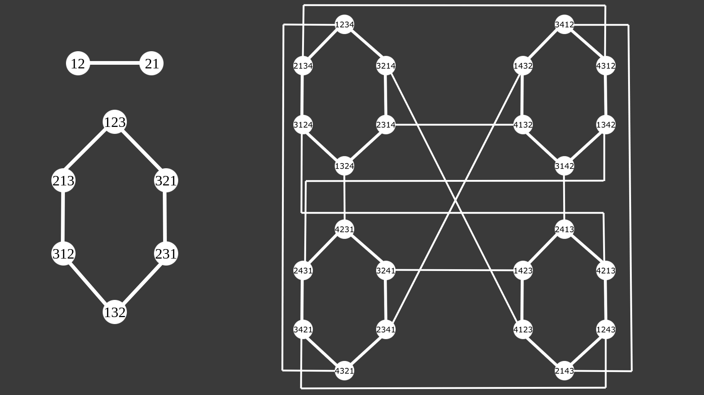

# Exercises lecture 14

## Exercise 1
### a)
Below is a drawing of the pancake graphs for *n* = 2, 3 and 4.
The number of vertices seem to always be the factorial of *n* (2, 6, 24, ...).
Similarly the number of edges seem to always be *6* to the power of *n* (1, 6, 36, ...).

### b)
The degree for *Pn* seem to be *n-1*

### c)
My observation from my own drawing is that the diameter is (1, 3, 4) for the ones I have drawn. I couldn't find a nice pattern so I looked it up and apparently there is no obvious pattern.
The bounds are 15/14*n* to 18/11*n*.

### d)
in a *Pn* (*n* >= 3) pancake graph, there is always at least one cycle of length *l* where 6 <= *l* <= *n!*.
This implies that the graph is Hamiltonian. 

### e)
A DHT can be built where each vertex in the pancake graph is a node in the DHT.
The hash value of the files decide in which node it is to be stored.
The files are then looked up using the same hash function and accessing the node in which a file is stored.
