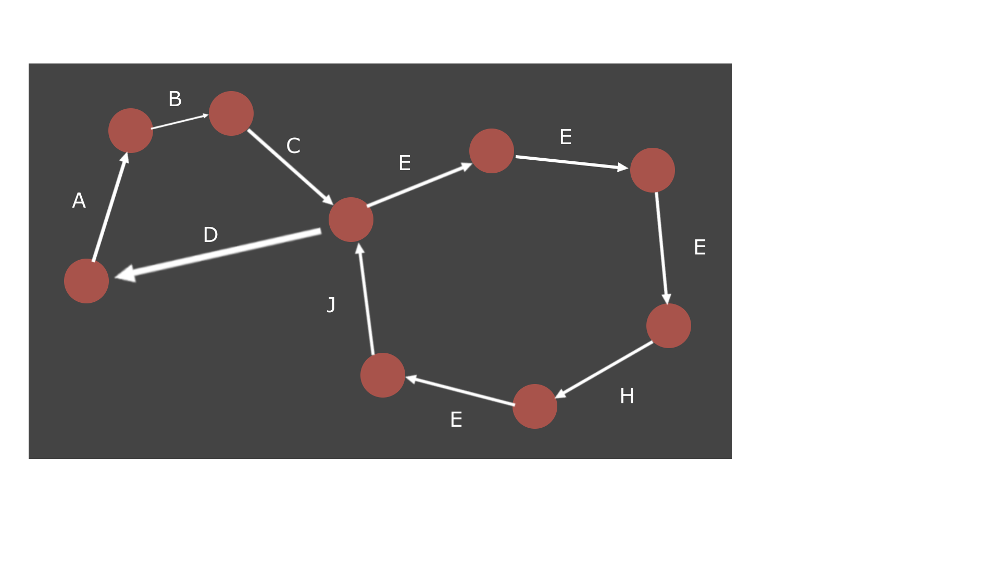

# Exercises lecture 2

## Exercise 1

1. What are the relevant events?

	- entering method *increment()*

	- reading value of variable *x*

	- adding 1 to local version of *x*

	- writing updated value to non-local variable *x*

	- returning from method *increment()*

	- creating, reading, comparing and writing to local variable *i*

	- enter and return from methods *actor1()* and *actor2()*

2. Sketch the state machine graph (only parts, it is quite large). Include all events you have identified in 1.

	- A - Enter *actorX()*

	- B - Initialize *i*

	- C - Compare *i* with 10
	
	- D - Return from *actorX()*

	- E - Enter *increment()*

	- F - Read *x*

	- G - Add 1 to local *x*

	- H - Write *x*

	- I - Return from *increment()*

	- J - Increment *i*

3. Sketch a few traces of the state machine.

s0 -> A -> B -> C -> E -> F -> G -> H -> I -> J -> C -> D -> s0

This trace is based on the for loop running just one loop.

4. List the relevant intervals for the program.

A -> D, E -> I

5. Which are the possible final values for x?  Explain your reasoning very carefully.

Any value from 10 to 20. Actor1 could read the value, increment it, but before it writes the new value Actor2 could read it and do the same thing, resulting in a total incrementation of 1. 

## Exercise 3

It works for 2 or fewer threads.

If there are 3 or more threads and at least 2 of them are competing for the lock, then when 

	y = -1
both the threads can access the criticla section simultaneously.

## Exercise 4

The doorway section is needed to determine the order in which the threads arrived at the lock.